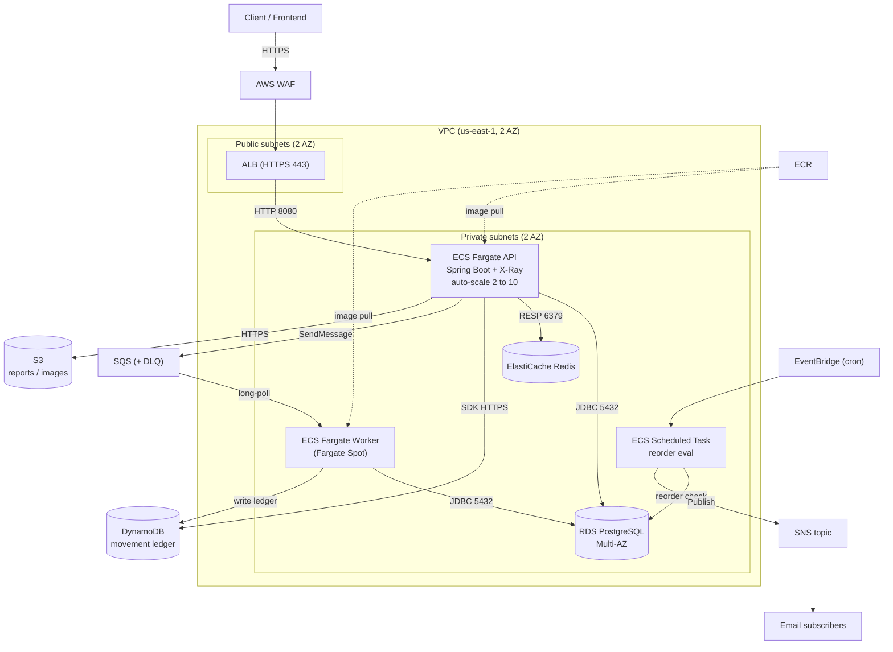

# Cloud-Native Inventory Management System (IMS)

A multi-warehouse Inventory Management System built for **CSCI 5411 — Advanced
Cloud Architecting** (graduate track). It demonstrates a production-shaped AWS
architecture — ECS Fargate, RDS PostgreSQL, DynamoDB, ElastiCache, SQS/SNS, S3,
EventBridge, WAF, and CloudWatch/X-Ray — provisioned entirely with Terraform and
delivered by a GitHub Actions CI/CD pipeline, within the constraints of the
AWS Academy Learner Lab.

> Full planning, rubric mapping, and the execution plan are in
> [`PROJECT_PLAN.md`](PROJECT_PLAN.md). This README is the developer-facing
> overview and quickstart.

---

## Architecture summary

A client request enters over HTTPS through **WAF + ALB** (public subnets), is
routed to the **Spring Boot API on ECS Fargate** (private subnets), which reads
hot data from **Redis**, persists to **RDS PostgreSQL**, and enqueues stock
movements onto **SQS**. A **worker** drains SQS, updates RDS plus an append-only
**DynamoDB ledger**, and publishes low-stock alerts to **SNS**. A scheduled
**EventBridge** job runs nightly reorder evaluation. See
[docs/ARCHITECTURE.md](docs/ARCHITECTURE.md) for the full narrative, protocols,
and sequence diagram.



---

## Tech stack

| Layer | Choice |
|---|---|
| Backend | Java 21, Spring Boot 3, Gradle, Lombok |
| Frontend | React + Vite + TypeScript |
| Compute | ECS Fargate (ARM64/Graviton) + ALB; Fargate Spot worker |
| Relational DB | RDS PostgreSQL (Multi-AZ) |
| NoSQL | DynamoDB (movement ledger) |
| Cache | ElastiCache Redis |
| Object store | S3 |
| Messaging | SQS (+ DLQ) + SNS |
| Eventing | EventBridge (cron) |
| Edge / security | AWS WAF, KMS, SSM Parameter Store / Secrets Manager |
| Observability | CloudWatch (logs/metrics/alarms/dashboard), X-Ray |
| AI (optional) | Bedrock with statistical (EWMA) fallback |
| IaC | Terraform (S3 state + DynamoDB lock) |
| CI/CD | GitHub Actions |
| Registry | ECR |

---

## Repository layout

```
InventoryManagementSystem/
├── app/                      # Spring Boot service (API + SQS worker + scheduled task)
│   ├── src/main/java/...
│   ├── Dockerfile            # multi-stage, Graviton/ARM64 base; listens 8080, health /api/v1/health
│   ├── build.gradle  settings.gradle  gradlew  # Gradle build + wrapper
│   └── src/...
├── frontend/                 # React + Vite + TypeScript demo UI
├── infra/                    # Terraform
│   ├── bootstrap/            # S3 state bucket + DynamoDB lock (run once)
│   ├── modules/              # vpc, alb, ecs, rds, dynamodb, cache, messaging, observability
│   └── main.tf  variables.tf  outputs.tf  backend.tf
├── .github/workflows/
│   ├── ci-cd.yml             # test -> build ARM64 image -> push ECR -> deploy ECS
│   └── terraform.yml         # fmt -check + validate on infra/ PRs
├── docs/                     # architecture, well-architected, decisions, runbook, diagrams
├── README.md                 # this file
└── PROJECT_PLAN.md           # full plan + rubric mapping
```

---

## Prerequisites

- **JDK 21** (Temurin); Gradle via the bundled wrapper (`./gradlew`)
- **Node 20+** and npm
- **Docker** with **Buildx** (for ARM64 image builds)
- **Terraform 1.9+**
- **AWS CLI v2**, configured with **Learner Lab session credentials**
  (access key + secret + **session token**), region `us-east-1`

---

## Local development quickstart

No AWS account is needed to run the app locally — use the `local` profile and
the frontend's mock mode.

**Backend (mock/local profile):**
```bash
cd app
./gradlew bootRun --args='--spring.profiles.active=local'
# API on http://localhost:8080, health at /api/v1/health
```

**Frontend (mock mode, talks to local API or stubs):**
```bash
cd frontend
npm ci
npm run dev     # Vite dev server (mock mode)
```

**Run the test suites:**
```bash
cd app && ./gradlew test
cd frontend && npm ci && npm run build
```

---

## Deploying to AWS

All infrastructure is Terraform; the app is delivered by CI/CD. Full
step-by-step instructions for the Learner Lab — bootstrap remote state,
provision the platform, build/push the image, deploy, and verify — plus a
per-service Learner Lab availability check, are in
**[docs/DEPLOYMENT.md](docs/DEPLOYMENT.md)**. Operational procedures (rollback,
teardown, failure scenarios) are in [docs/RUNBOOK.md](docs/RUNBOOK.md).

The short version:

1. Refresh Learner Lab session credentials (expire ~4h).
2. `cd infra/bootstrap && terraform apply` — creates the S3 state bucket + lock table (once).
3. `cd infra && terraform apply` — VPC, ALB, ECS, RDS, DynamoDB, Redis, SQS/SNS, ECR, ...
4. Push the ARM64 image to ECR (via CI/CD on merge to `main`, or manually) and
   force a new ECS deployment.

> **Learner Lab note:** session credentials expire (~4h) and the lab forbids
> creating IAM roles, so we reuse `LabRole` and store session creds as GitHub
> secrets. GitHub OIDC is the production approach; see
> [docs/DECISIONS.md](docs/DECISIONS.md) (ADR-0006).

---

## Documentation

- [docs/ARCHITECTURE.md](docs/ARCHITECTURE.md) — components, boundaries, data flows, diagrams, sequence narrative
- [docs/WELL_ARCHITECTED.md](docs/WELL_ARCHITECTED.md) — six pillars + trade-offs
- [docs/DECISIONS.md](docs/DECISIONS.md) — ADR log (locked + open decisions)
- [docs/RUNBOOK.md](docs/RUNBOOK.md) — deploy, rollback, creds refresh, teardown, failure scenarios, demo script
- [docs/README.md](docs/README.md) — documentation index

---

## AI-usage disclosure

Generative AI tools (Anthropic Claude) were used as a development assistant on
this project — for scaffolding the CI/CD workflows and documentation, drafting
architecture/decision narratives, and reviewing configuration. All AI-assisted
output was reviewed, edited, and validated by the author, who is responsible for
the final design decisions, code, and submitted report. Architectural choices
and their trade-offs reflect the author's own analysis against the course rubric
and the Learner Lab constraints. The optional in-product AI demand-forecast
feature (Bedrock with a statistical fallback) is a separate runtime feature of
the system and is documented in [docs/DECISIONS.md](docs/DECISIONS.md) (ADR-0007).
