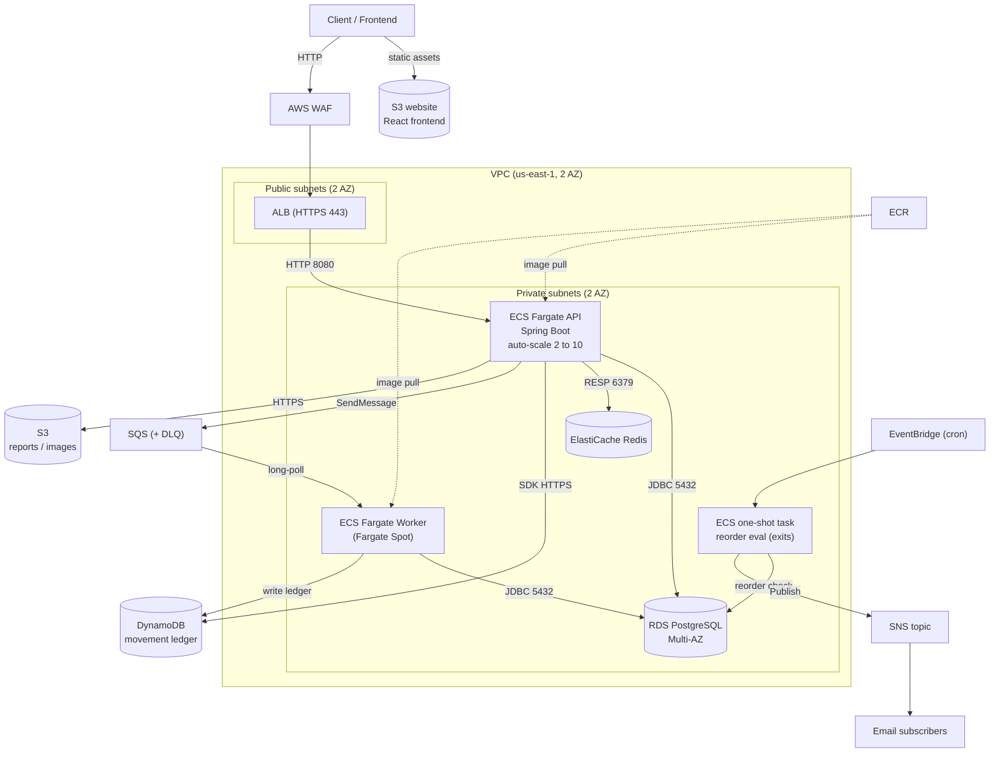

# Cloud-Native Inventory Management System (IMS)

A multi-warehouse Inventory Management System built for **CSCI 5411 — Advanced
Cloud Architecting** (graduate track). It demonstrates a production-shaped AWS
architecture — ECS Fargate, RDS PostgreSQL, DynamoDB, ElastiCache, SQS/SNS, S3,
EventBridge, WAF, and CloudWatch/X-Ray — provisioned entirely with Terraform and
delivered by a GitHub Actions CI/CD pipeline, within the constraints of the
AWS Academy Learner Lab.

---

## Architecture summary

The **React frontend is served from an S3 static website**; it calls the API
through **WAF + ALB** (public subnets), which routes to the **Spring Boot API
on ECS Fargate** (private subnets). The API reads hot data from **Redis**,
persists to **RDS PostgreSQL**, and enqueues stock movements onto **SQS**. A
**worker** drains SQS, updates RDS plus an append-only **DynamoDB ledger**, and
publishes low-stock alerts to **SNS**. An **EventBridge cron rule** launches a
**one-shot Fargate task** nightly that runs the reorder evaluation and exits.



---

## Tech stack

| Layer | Choice |
|---|---|
| Backend | Java 21, Spring Boot 3, Gradle, Lombok |
| Frontend | React + Vite + TypeScript, hosted on an S3 static website |
| Compute | ECS Fargate (ARM64/Graviton) + ALB; Fargate Spot worker |
| Relational DB | RDS PostgreSQL (Multi-AZ) |
| NoSQL | DynamoDB (movement ledger) |
| Cache | ElastiCache Redis |
| Object store | S3 |
| Messaging | SQS (+ DLQ) + SNS |
| Eventing | EventBridge (cron) → one-shot Fargate reorder task |
| Edge / security | AWS WAF, KMS, SSM Parameter Store / Secrets Manager |
| Observability | CloudWatch (logs/metrics/alarms/dashboard), X-Ray |
| AI (optional) | Gemini (free AI Studio key) or Claude API demand forecast with statistical (EWMA) fallback; Bedrock variant included (blocked in Learner Lab) |
| IaC | Terraform (S3 state + DynamoDB lock) |
| CI/CD | GitHub Actions |
| Registry | ECR |

---

## Repository layout

```
InventoryManagementSystem/
├── app/                      # Spring Boot service (API + SQS worker + scheduled task)
│   ├── src/main/java/...
│   ├── Dockerfile            # multi-stage, Graviton/ARM64 base; listens 8080, health /api/v1/health
│   ├── build.gradle  settings.gradle  gradlew  # Gradle build + wrapper
│   └── src/...
├── frontend/                 # React + Vite + TypeScript demo UI
├── infra/                    # Terraform
│   ├── bootstrap/            # S3 state bucket + DynamoDB lock (run once)
│   ├── modules/              # vpc, alb, ecs, rds, dynamodb, cache, messaging, observability
│   └── main.tf  variables.tf  outputs.tf  backend.tf
├── .github/workflows/
│   ├── ci-cd.yml             # test -> build ARM64 image -> push ECR -> deploy ECS (api + worker) -> sync frontend to S3
│   └── terraform.yml         # fmt -check + validate on infra/ PRs
└── README.md                 # this file
```

---

## Prerequisites

- **JDK 21** (Temurin); Gradle via the bundled wrapper (`./gradlew`)
- **Node 20+** and npm
- **Docker** with **Buildx** (for ARM64 image builds)
- **Terraform 1.9+**
- **AWS CLI v2**, configured with **Learner Lab session credentials**
  (access key + secret + **session token**), region `us-east-1`

---

## Local development quickstart

The backend's `local` profile runs entirely in-memory (H2 database, AWS
integrations disabled), so no AWS account is needed to run it.

**Backend (local profile):**
```bash
cd app
./gradlew bootRun --args='--spring.profiles.active=local'
# API on http://localhost:8080, health at /api/v1/health
```

**Frontend:** the frontend always talks to a real API over `/api/v1`. The Vite
dev server proxies `/api` to `VITE_API_TARGET` (set in `frontend/.env`; defaults
to a local backend at `http://localhost:8080`, or point it at a deployed ALB).
```bash
cd frontend
cp .env.example .env     # then edit VITE_API_TARGET if needed
npm ci
npm run dev              # Vite dev server on http://localhost:5173
```

**Run the test suites:**
```bash
cd app && ./gradlew test
cd frontend && npm ci && npm run build
```

---

## Deploying to AWS (Learner Lab)

### One-command deploy

`scripts/deploy.sh` does everything below in one shot — paste your Learner Lab
credentials when prompted and it bootstraps the Terraform backend, applies the
full stack, builds/pushes the ARM64 image, rolls both ECS services, deploys the
frontend to S3, and waits for the health check. It is idempotent: re-run it
with fresh credentials after the lab session expires.

```bash
./scripts/deploy.sh                          # prompts for the AWS CLI creds block
./scripts/deploy.sh --alert-email you@x.com  # also subscribe SNS low-stock alerts
./scripts/deploy.sh --destroy                # full teardown (protect lab budget)
```

Needs: aws CLI v2, Terraform 1.6+, Docker (buildx), Node 20+. On Windows run it
from **Git Bash**. The generated `infra/terraform.tfvars` (random DB password)
is gitignored — keep it, later runs reuse it.

### Manual steps

All infrastructure is Terraform; the application image is built and deployed to
ECS. The steps below are self-contained. Region is pinned to `us-east-1`. The
`LabRole` is auto-discovered by Terraform, so you never supply IAM ARNs.

### 1. Refresh Learner Lab credentials (each session, ~4h expiry)

Start the lab → **AWS Details → AWS CLI** → copy the three values:

```bash
export AWS_ACCESS_KEY_ID=...
export AWS_SECRET_ACCESS_KEY=...
export AWS_SESSION_TOKEN=...          # mandatory for Learner Lab
export AWS_REGION=us-east-1
aws sts get-caller-identity            # verify
```

### 2. Bootstrap remote state (run once, ever)

```bash
cd infra/bootstrap
terraform init
terraform apply -var="state_bucket_name=ims-tf-state-<YOUR_ACCOUNT_ID>"
```

Then set the `bucket` line in `infra/backend.tf` to the exact name you used.

### 3. Configure variables

```bash
cd ../            # into infra/
cp terraform.tfvars.example terraform.tfvars
# edit terraform.tfvars: set a real db_password; keep db_multi_az/redis_multi_az
# false for a cheap lab run; leave container_image empty on the first apply.
```

### 4. Provision the platform

```bash
terraform init          # initialises the S3 backend from step 2
terraform apply         # VPC, ALB, ECS, RDS, DynamoDB, Redis, SQS/SNS, ECR, WAF
terraform output        # note ecr_repo_url and alb_dns_name
```

The ECS service starts unhealthy until an image is pushed — that's expected.
Confirm the SNS subscription email if you set `alert_email`.

### 5. Build & push the image, then deploy

**Option A — CI/CD:** add repo secrets `AWS_ACCESS_KEY_ID`,
`AWS_SECRET_ACCESS_KEY`, `AWS_SESSION_TOKEN`, then merge to `main`. The pipeline
tests, builds the ARM64 image, pushes to ECR, forces new deployments of the
**api and worker** services, then builds the frontend against the live ALB and
syncs it to the S3 website bucket.

**Option B — Manual:**
```bash
ECR=$(terraform output -raw ecr_repo_url)          # from infra/
aws ecr get-login-password --region us-east-1 \
  | docker login --username AWS --password-stdin "${ECR%/*}"
cd ../app
docker buildx build --platform linux/arm64 -t "$ECR:latest" --push .
# names are <project>-<environment>-* (e.g. ims-dev-*); deploy both services:
aws ecs update-service --cluster ims-dev-cluster --service ims-dev-api    --force-new-deployment --region us-east-1
aws ecs update-service --cluster ims-dev-cluster --service ims-dev-worker --force-new-deployment --region us-east-1

# frontend: build against the ALB, then sync to the website bucket
cd ../frontend
ALB=$(cd ../infra && terraform output -raw alb_dns_name)
BUCKET=$(cd ../infra && terraform output -raw frontend_bucket)
npm ci
VITE_API_BASE_URL="http://$ALB" npm run build
aws s3 sync dist "s3://$BUCKET" --delete
```

> On Windows PowerShell, don't pipe `get-login-password` into `docker login`
> (it corrupts the token); capture it and pass with `--password` instead.

### 6. Verify

```bash
ALB=$(cd ../infra && terraform output -raw alb_dns_name)
curl "http://$ALB/api/v1/health"        # expect {"status":"UP",...}
cd ../infra && terraform output -raw frontend_website_url   # open in a browser
```

The nightly reorder scan is an EventBridge rule (`terraform output
reorder_schedule_rule`) that launches a one-shot Fargate task (02:00 UTC by
default; tune `reorder_schedule` in tfvars). To demo it without waiting, run
the same task on demand:

```bash
aws ecs run-task --cluster ims-dev-cluster \
  --task-definition ims-dev-scheduler --launch-type FARGATE \
  --network-configuration "awsvpcConfiguration={subnets=[<private-subnet-id>],securityGroups=[<ecs-sg-id>],assignPublicIp=DISABLED}" \
  --region us-east-1
# then check the /ecs/ims-dev/scheduler log group for the scan summary
```

### Teardown (protect the lab budget)

```bash
# cheap pause: scale services to zero and stop the DB
aws ecs update-service --cluster ims-dev-cluster --service ims-dev-api    --desired-count 0 --region us-east-1
aws ecs update-service --cluster ims-dev-cluster --service ims-dev-worker --desired-count 0 --region us-east-1
aws rds stop-db-instance --db-instance-identifier ims-dev-pg --region us-east-1
# or full teardown (leave infra/bootstrap in place):
cd infra && terraform destroy
```

### Learner Lab notes

- Session credentials expire (~4h). On `ExpiredToken` / `InvalidClientTokenId`,
  redo step 1 and re-run.
- The lab forbids creating IAM roles, so the stack reuses the pre-existing
  `LabRole` for both the ECS execution and task roles (auto-discovered).
- WAF is sometimes blocked by the lab SCP. It's gated by `enable_waf` — set it
  to `false` in `terraform.tfvars` if `terraform apply` fails on the web ACL.
